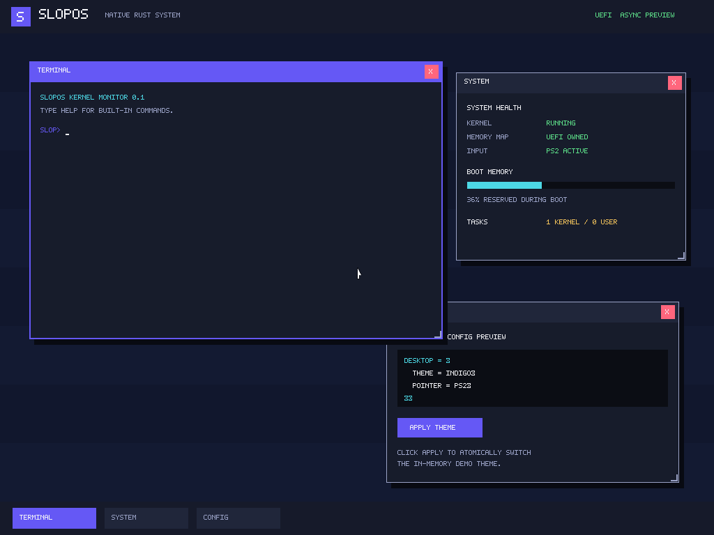

# SlopOS

SlopOS 是一个从零实现、以 Rust 为主要语言、面向 x86-64 UEFI/QEMU 的独立操作系统项目。

当前仓库已经有一个可重复启动的早期系统，而不是完成版操作系统：0BSD Rust UEFI 加载器会从 FAT ESP 读取并解析独立的 ELF64 内核，取得 ACPI RSDP 与 GOP，加载 bootstrap image，取得最终 memory map，调用 `ExitBootServices`，再把控制权交给 SlopOS 内核。内核接管串口、GOP framebuffer 与 PS/2 键鼠，并直接进入一个早期交互桌面。

内核还会在启动时通过一个独立的 eBPF verifier 执行内建测试程序；当前只是无动态分配、前向控制流的安全子集，并不声称兼容 Linux eBPF。



早期桌面已实际验证：

- 三个可叠放窗口和任务栏；
- 鼠标焦点、拖动、缩放、关闭与重新打开；
- 键盘输入；
- 可执行 `HELP`、`STATUS`、`ABOUT`、`CLEAR` 的图形 kernel monitor；
- 系统状态窗口；
- 可点击应用的内存主题配置预览。

这些功能目前仍在内核态，不能视为已经实现用户进程、隔离、多任务、声明式配置语言或 Wayland。完整、保守的完成度见 [docs/status.md](docs/status.md)。

## 构建与运行

已验证环境：

- Debian trixie x86-64；
- Rust 1.88.0（由 `rust-toolchain.toml` 固定）；
- QEMU 10.0.11；
- OVMF 2025.02；
- `mtools`、`dosfstools`；
- 可选 `netpbm`，用于把 QEMU PPM 截图转换为 PNG。

安装 Rust target 后：

```bash
make image
make test-acpi
make test-ebpf
make test-boot
make test-interaction
make test-page-fault
make run
```

`make test-acpi` 在宿主运行 RSDP/XSDT/MADT parser 的构造表测试，`make test-ebpf` 运行 verifier/interpreter 边界测试。`make test-boot` 在 OVMF 中启动镜像并验证 UEFI、`ExitBootServices`、内核接管、自有 CR3/heap、eBPF 实际执行、ACPI、LAPIC/IOAPIC IRQ、async timer 和桌面循环的串口标记。`make test-interaction` 通过 QEMU 注入真实 PS/2 键盘和鼠标事件，执行 `STATUS` 并拖动终端窗口。`make test-page-fault` 注入未映射地址访问并核验 vector 14、RIP、error code 和 CR2。

`make run` 打开 QEMU 图形窗口。桌面中可以直接输入命令；拖动标题栏、拖动右下角、点击红色 `X` 和任务栏按钮分别用于移动、缩放、关闭和恢复窗口。

## 设计边界

- SlopOS 原创源码均为 Rust，许可证为 0BSD。
- 当前只使用三个 MIT/Apache-2.0 Rust 依赖；见 [docs/dependencies.md](docs/dependencies.md)。
- UEFI 高层包装由 SlopOS 自己实现，仅使用宽松许可证的 `uefi-raw` 数据布局和函数表绑定。
- 内联汇编只用于 x86 I/O port、`cli`、`pause` 和 `hlt`；安全边界见 [docs/architecture.md](docs/architecture.md)。
- 不依赖 Linux、GRUB 或宿主桌面来运行 SlopOS 代码。

## 文档

- [架构和启动协议](docs/architecture.md)
- [逐子系统完成度](docs/status.md)
- [异步内核设计状态](docs/async-kernel.md)
- [ACPI 与 APIC 中断路径](docs/acpi-apic.md)
- [eBPF 子集与验证边界](docs/ebpf.md)
- [依赖与许可证](docs/dependencies.md)
- [已知问题](docs/known-issues.md)
- [验证证据](evidence/README.md)
